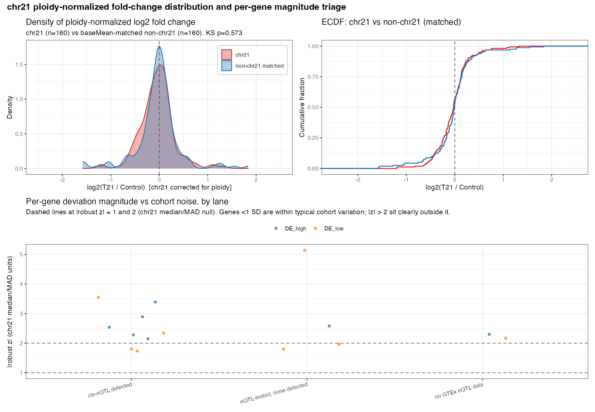

```{r setup, include=FALSE}
knitr::opts_chunk$set(echo = FALSE, message = FALSE, warning = FALSE)
suppressPackageStartupMessages({
  library(dplyr)
  library(tidyr)
  library(knitr)
  library(here)
})

lanes <- read.csv(here("results/tables/chr21_lane_assignments.csv"))
dev   <- lanes %>% filter(sig_lane %in% c("DE_high", "DE_low"))

n_total    <- nrow(lanes)
bm_cut     <- quantile(lanes$baseMean, 0.20, na.rm = TRUE)  # script 04's low-expression cutoff
n_expected <- sum(lanes$sig_lane == "Expected_dosage")
n_repeat   <- sum(lanes$sig_lane == "High_repeats")
n_lowexpr  <- sum(lanes$sig_lane == "Low_expression")
n_dev      <- nrow(dev)
n_high     <- sum(dev$sig_lane == "DE_high")
n_low      <- sum(dev$sig_lane == "DE_low")
n_tier1    <- sum(dev$tier == 1)
n_tier2    <- sum(dev$tier == 2)
n_cis      <- sum(dev$eqtl_lane == "cis_eqtl")
n_nocis    <- sum(dev$eqtl_lane == "no_cis_eqtl")
n_nogtex   <- sum(dev$eqtl_lane == "no_GTEx_data")

gene_list <- function(d) paste(sort(d$Gene_name), collapse = ", ")
cand_tested   <- dev %>% filter(eqtl_lane == "no_cis_eqtl")
cand_untested <- dev %>% filter(eqtl_lane == "no_GTEx_data")

git_rev <- tryCatch(
  system("git rev-parse --short HEAD", intern = TRUE),
  error = function(e) "unknown"
)
```

Computed from the pipeline outputs in `results/tables/` at commit
`` `r git_rev` ``. To refresh after a pipeline run:
`Rscript -e 'rmarkdown::render("docs/summary.Rmd")'`. Methodology and
its history: `README.md` and `docs/decisions.md`.

## Overview

Of the **`r n_total`** chr21 protein-coding genes classified:
**`r n_expected`** are Expected dosage, **`r n_repeat`** are flagged as high repeats and
**`r n_lowexpr`** low-expression (baseMean below the chr21 20th percentile,
`r round(bm_cut, 1)` here), and
**`r n_dev`** deviate (**`r n_high`** DE_high, **`r n_low`** DE_low;
**`r n_tier1`** tier 1 (padj < 0.01 and |corrected log2FC| >= log2(1.5), a
fold-change magnitude of 1.5 in either direction), **`r n_tier2`** tier 2,
near-threshold (padj < 0.01 and log2(4/3) <= |corrected log2FC| <
log2(1.5))). Of the deviating genes,
**`r n_cis`** have a detectable GTEx whole-blood cis-eQTL, **`r n_nocis`**
were tested and have none, and **`r n_nogtex`** have no GTEx cis coverage.

```{r lane-table}
lanes %>%
  count(sig_lane, eqtl_lane) %>%
  pivot_wider(names_from = eqtl_lane, values_from = n, values_fill = 0) %>%
  mutate(Total = rowSums(across(where(is.numeric)))) %>%
  arrange(desc(Total)) %>%
  kable(caption = "Lane counts by eQTL terminal. cis_eqtl is a detection result (q_gene_bh < 0.05), not an 'explained by eQTL' claim.")
```


## Deviating genes

```{r dev-table}
dev %>%
  transmute(
    Gene = Gene_name,
    lane = sig_lane,
    tier,
    log2FC = round(norm_log2FC, 2),
    padj = formatC(norm_padj, format = "e", digits = 1),
    eqtl = eqtl_lane,
    q_perm = signif(q_gene_bh, 2),
    composition = verdict,
    residual_lfc = round(residual_lfc, 2)
  ) %>%
  arrange(lane, desc(abs(log2FC))) %>%
  kable(caption = "Ploidy-corrected stats, gene-level permutation q, and composition-control verdict.
  composition = verdict from the partner-shift test (p = p_partners):
   PROGRAM if p < 0.05 and partner_lfc / gene_lfc >= 0.5;
   MIXED if p < 0.05 otherwise;
   GENE-SPECIFIC for every other case (unconditional fallback).
  residual_lfc = gene log2FC minus the median log2FC of its 20 control-defined co-expression partners.")
```


Deviating genes without a detectable common cis-eQTL remain open as
compensation candidates (absence of a detection does not by itself
establish compensation):

- Tested against GTEx, no detection (`r nrow(cand_tested)`):
  **`r gene_list(cand_tested)`**
- No GTEx cis coverage, untestable here (`r nrow(cand_untested)`):
  **`r gene_list(cand_untested)`**

## Figures

Copies of the pipeline figures, tracked under `docs/figures/`. To refresh
them, re-run scripts 06 and 07 (and re-export the lane flow from
SankeyMATIC using `results/tables/chr21_lane_sankeymatic_input.txt`), copy
the PNGs into `docs/figures/`, and re-render this document.

### chr21 vs baseMean-matched non-chr21 ploidy-corrected log2FC distributions, with the per-lane magnitude scatter (script 06):

```{r fig-dist, out.width="100%", fig.alt="Three-panel figure. Top left: overlaid density curves of ploidy-corrected log2 fold change for chr21 protein-coding genes and for baseMean-matched non-chr21 genes; the two curves largely coincide and centre on zero. Top right: the corresponding empirical cumulative distributions. Bottom: per-gene absolute robust z against the chr21 median/MAD null for the DE_high and DE_low genes, grouped by eQTL terminal (cis-eQTL detected, eQTL-tested with none detected, no GTEx cis-eQTL data), with dashed reference lines at 1 and 2."}

```

### Volcano summary panel, all-genes before/after ploidy correction and chr21-only (script 07):

```{r fig-volcano, out.width="100%", fig.alt="Four volcano plots of log2 fold change (T21 vs Control) against minus log10 adjusted p-value. Panel A: all genes uncorrected, with chr21 genes shifted right around the 1.5-fold expectation. Panel B: all genes after ploidy correction, with chr21 genes centred on zero. Panels C and D repeat this for the chr21 protein-coding genes only. Deviating genes are labelled and coloured by direction and eQTL terminal, with tier 1 genes in bold."}
include_graphics("./figures/Chr21_DEG.png")
```

### Sankey plot generated with SankeyMATIC

```{r fig-sankey, out.width="100%", fig.alt="Sankey diagram of the chr21 protein-coding genes. From the full set, flows split into Expected dosage, Not assessable (which divides into High repeats and Low expression), and Outside dosage expectation. The last divides into DE high and DE low, which then terminate at cis-eQTL detected, no GTEx cis-eQTL data (labelled 'no GTEX QTL' in the figure), or no cis-eQTL detected. Node labels carry the gene counts."}
include_graphics("./figures/Sankey.png")
```
