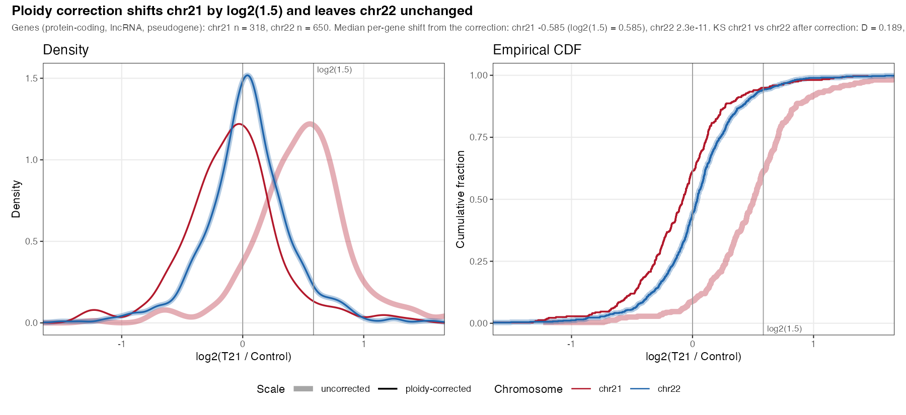
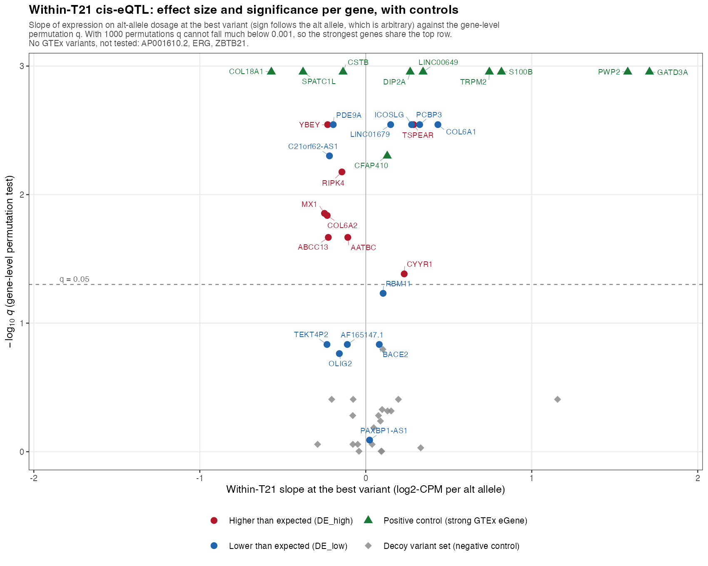
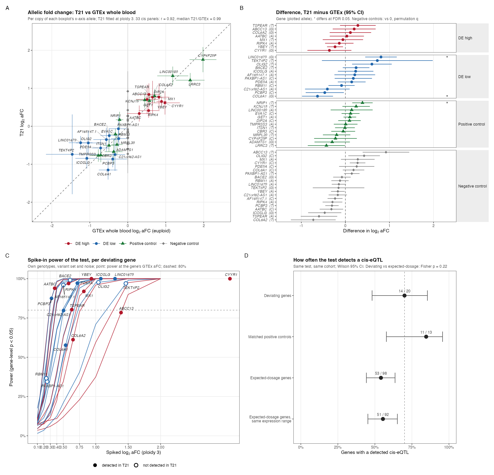

```{r setup, include=FALSE}
knitr::opts_chunk$set(echo = FALSE, message = FALSE, warning = FALSE)
suppressPackageStartupMessages({
  library(dplyr)
  library(knitr)
  library(here)
})

lanes <- read.csv(here("results/runs/baseline/tables/chr21_lane_assignments.csv"))
dev   <- lanes %>% filter(sig_lane %in% c("DE_high", "DE_low"))

n_total    <- nrow(lanes)
bm_cut     <- 30  # script 04's low-expression cutoff (Hunter et al.'s coverage floor)
n_pc       <- sum(lanes$Gene_type == "protein_coding")
n_lnc      <- sum(lanes$Gene_type == "lncRNA")
n_pseudo   <- sum(grepl("pseudogene", lanes$Gene_type))
n_expected <- sum(lanes$sig_lane == "Expected_dosage")
n_repeat   <- sum(lanes$sig_lane == "High_repeats")
n_lowexpr  <- sum(lanes$sig_lane == "Low_expression")
n_dev      <- nrow(dev)
n_high     <- sum(dev$sig_lane == "DE_high")
n_low      <- sum(dev$sig_lane == "DE_low")
n_tier1    <- sum(dev$tier == 1)
n_tier2    <- sum(dev$tier == 2)
n_cis      <- sum(dev$eqtl_lane == "cis_eqtl")
n_nocis    <- sum(dev$eqtl_lane == "no_cis_eqtl")
n_nogtex   <- sum(dev$eqtl_lane == "no_GTEx_data")

gene_list <- function(d) paste(sort(d$Gene_name), collapse = ", ")
cand_tested   <- dev %>% filter(eqtl_lane == "no_cis_eqtl")
cand_untested <- dev %>% filter(eqtl_lane == "no_GTEx_data")

git_rev <- tryCatch(
  system("git rev-parse --short HEAD", intern = TRUE),
  error = function(e) "unknown"
)
```

Rendered at commit `` `r git_rev` `` (the commit checked out when this
document was last knitted; `results/` is gitignored, so the outputs
themselves are not versioned). This document reads:

- `results/runs/baseline/tables/`: `chr21_lane_assignments.csv` (script
  04) - every number and gene list in the baseline sections;
  `eqtl_controls_summary.csv` (script 03); `positive_control_matching.csv`
  (script 02); `eqtl_best_variant_effects.csv` (script 11).
- `config/runs/baseline.R` - the control thresholds quoted in the text.
- `results/runs/adjusted/`: `processed/cohort_roster.csv` (script 01);
  `tables/chr21_lane_assignments.csv` (script 04);
  `tables/run_comparison_adjusted_vs_baseline.csv` (script 10).
- `docs/figures/` - the PNGs embedded under Figures and in the adjusted-run
  section (copies of the outputs of scripts 06, 07, 10, 11, 14 and S1), and
  `Sankey.png`, the SankeyMATIC render of
  `results/runs/<run>/tables/chr21_lane_sankeymatic_input.txt` (script 05).

To refresh after a pipeline run:
`Rscript -e 'rmarkdown::render("docs/summary.Rmd")'`. Methodology and
its history: `README.md` and `docs/decisions.md`.

## Overview

Of the **`r n_total`** chr21 genes classified (**`r n_pc`** protein-coding,
**`r n_lnc`** lncRNA, **`r n_pseudo`** pseudogene: the biotypes GTEx whole
blood tests for cis-eQTLs):
**`r n_expected`** are Expected dosage, **`r n_repeat`** are flagged as high repeats and
**`r n_lowexpr`** low-expression (baseMean below Hunter et al.'s coverage
floor of `r bm_cut`), and
**`r n_dev`** deviate (**`r n_high`** DE_high, **`r n_low`** DE_low;
**`r n_tier1`** tier 1 (padj < 0.01 and |corrected log2FC| >= log2(1.5), a
fold-change magnitude of 1.5 in either direction), **`r n_tier2`** tier 2,
near-threshold (padj < 0.01 and log2(4/3) <= |corrected log2FC| <
log2(1.5))). Of the deviating genes,
**`r n_cis`** have a detectable GTEx whole-blood cis-eQTL, **`r n_nocis`**
were tested and have none, and **`r n_nogtex`** have no GTEx cis coverage.
A cis-eQTL call is a detection result (q_gene_bh < 0.05), not an
"explained by eQTL" claim.

## Deviating genes

Deviating genes that carry no detected cis-eQTL. These deviations are not
accompanied by detectable cis-regulatory variation; the pipeline does not
attribute them to a mechanism:

- Tested against GTEx, no detection (`r nrow(cand_tested)`):
  **`r gene_list(cand_tested)`**
- No GTEx cis coverage, untestable here (`r nrow(cand_untested)`):
  **`r gene_list(cand_untested)`**

## Controls for the eQTL test

```{r controls-setup, include=FALSE}
th     <- source(here("config/runs/baseline.R"))$value$thresholds
ctrl_b <- read.csv(here("results/runs/baseline/tables/eqtl_controls_summary.csv"))
match_b <- read.csv(here("results/runs/baseline/tables/positive_control_matching.csv"))
cs <- function(set, col) ctrl_b[[col]][ctrl_b$set == set]
```

Two standalone gene sets go through the identical gene-level permutation
test (same runner, 1000 permutations, BH within the set, q <
`r th$fdr_gene`).

**Negative control, unlinked variants.** Each deviating gene's expression
is tested against `r th$n_decoy_sets` cis variant sets of other tested
genes (deviating genes and positive controls) whose TSS is at least
`r th$decoy_min_distance / 1e6` Mb away, so no decoy set can be in LD with
the gene's own locus. Sets with the closest variant count are taken first,
and decoy variants below GTEx MAF `r th$decoy_min_maf` are dropped. Same
genotypes, same subjects. Every decoy test is null, so BH should detect
none (with no true effects it holds the chance of any detection to the FDR
level), and about 5% of tests should reach nominal permutation p < 0.05.

**Positive control, matched GTEx eGenes.** Up to one control per tested
deviating gene, matched in order of decreasing GTEx effect size until the
one-per-locus rule below has used up the candidates (here
`r nrow(match_b)` of the
`r ctrl_b$n_tested[ctrl_b$set == "observed_deviating"]` tested genes),
drawn from the GTEx whole-blood eGenes (q <
`r format(th$positive_egene_qval, scientific = FALSE)`, with at least
`r th$positive_min_variants` variants at the GTEx pval cut) among
expressed, non-repeat, non-deviating chr21 genes: the candidate nearest the
deviating gene in GTEx allelic fold change and expression level, one per
locus (TSS at least `r th$positive_min_separation / 1e6` Mb from every
other control and `r th$positive_dev_separation / 1e3` kb from any
deviating gene), never a gene in a GRCh38 false duplication. Each is tested
on its own cis variants. Most should be detected; if not, the test lacks
power for effects of the size it is asked to find.

In the baseline run, `r cs("negative_unlinked_variants", "n_detected")` of
`r cs("negative_unlinked_variants", "n_tested")` decoy tests are detected
at q < `r th$fdr_gene` and `r cs("negative_unlinked_variants", "n_nominal_p05")`
reach nominal p < 0.05; `r cs("positive_gtex_egenes", "n_detected")` of
`r cs("positive_gtex_egenes", "n_tested")` matched positive controls are
detected, beside `r cs("observed_deviating", "n_detected")` of
`r cs("observed_deviating", "n_tested")` tested deviating genes. Both
control sets are drawn in the effect-size figure, and the detection rates
in panel D of the T21-versus-GTEx figure.

## Figures

Copies of the pipeline figures, tracked under `docs/figures/`. To refresh
them, re-run scripts 06, 07, 11, 15, 16, 14 and S1 for each run (and re-export the lane flow from
SankeyMATIC using `results/runs/<run>/tables/chr21_lane_sankeymatic_input.txt`), copy
the PNGs into `docs/figures/`, and re-render this document.

### Effect of ploidy correction on the log2FC distribution: chr21 uncorrected vs corrected, with chr22 as the unchanged control (script 06):

```{r fig-dist, out.width="100%", fig.alt="Two-panel figure. Left: overlaid density curves of log2 fold change (T21 vs Control) for chr21 and chr22 genes (protein-coding, lncRNA, pseudogene), each on the uncorrected and the ploidy-corrected scale. The uncorrected chr21 curve is centred near log2(1.5); the ploidy-corrected chr21 curve is shifted left by that amount, centres on zero and overlaps chr22. The two chr22 curves coincide. Right: the corresponding empirical cumulative distributions. Vertical reference lines mark 0 and log2(1.5)."}

```

### Volcano plots, all genes before and after ploidy correction (script 07):

```{r fig-volcano-all, out.width="100%", fig.alt="Two volcano plots of log2 fold change (T21 vs Control) against minus log10 adjusted p-value, all genes of the target biotypes in grey with chr21 genes in purple. Left, uncorrected: the chr21 cloud sits to the right of zero around the 1.5-fold expectation, marked by a dotted line, and is almost uniformly significant. Right, ploidy-corrected: the chr21 cloud is centred on zero and most of its significance is gone."}
include_graphics("./figures/baseline_volcano_all_genes.png")
```

### Volcano plots, chr21 only, deviating genes labelled (script 07):

```{r fig-volcano-chr21, out.width="100%", fig.alt="Two volcano plots restricted to chr21 genes, uncorrected on the left and ploidy-corrected on the right. Deviating genes are labelled and coloured by direction, red for higher than expected and blue for lower than expected, with tier 1 genes in bold; all other chr21 genes are grey."}
include_graphics("./figures/baseline_volcano_chr21.png")
```

### cis-eQTL effect size per gene, with its controls (script 11):

```{r fig-eqtl-effects, out.width="90%", fig.alt="Scatter plot with the within-T21 slope of expression per copy of the minor allele at the best variant on the x-axis and minus log10 of the gene-level permutation q on the y-axis, with a dashed line at q = 0.05. Green triangles are the matched positive-control GTEx eGenes, most on or near the top row with slopes from about -0.25 to 0.6, two below the line. Red and blue circles are deviating genes higher and lower than expected; most sit above the dashed line with slopes within about 0.45 of zero, and six sit below it. Grey diamonds are the decoy variant sets, all near the bottom, well below the line. The subtitle names the deviating genes with no GTEx variants."}

```

```{r effects-setup, include=FALSE}
eff <- read.csv(here("results/runs/baseline/tables/eqtl_best_variant_effects.csv"))
eff$set <- ifelse(grepl("Negative", eff$panel_group), "decoy",
                  ifelse(grepl("Positive", eff$panel_group), "positive control", "own variants"))
med_abs <- function(s) round(median(abs(eff$slope[eff$set == s]), na.rm = TRUE), 2)
```

Each point is one gene's best variant: its within-T21 slope on the x-axis
(per copy of the minor allele) and the gene-level
permutation q on the y-axis, the value that decides detection. The dashed
line is q = 0.05. The median absolute slope is `r med_abs("own variants")`
log2-CPM per allele on the deviating genes' own variants,
`r med_abs("decoy")` on their decoy sets, and `r med_abs("positive control")`
for the positive controls. With 1000 permutations q cannot fall much below
0.001, so the strongest genes share the top row and differ only in slope.
Genes with no GTEx variants have neither value and are named in the
subtitle. Every slope is the best of many variants, so it is inflated by
that selection; the decoys show that a large best-variant slope can occur
with no cis link.

### Expression by genotype for every tested deviating gene (script 11; the controls are drawn the same way in `eqtl_dosage_controls`):

```{r fig-dosage-panels, out.width="100%", fig.alt="Two rows of box-and-jitter panels, one per tested deviating gene, showing expression in T21 subjects against the dosage (0 to 3 copies) at the gene's best variant of the allele whose GTEx effect runs the way the gene deviates. Row A, DE high genes in red, is drawn on the expression-raising allele, so a panel that reproduces GTEx trends up; row B, DE low genes in blue, on the expression-lowering allele, so it trends down. Each strip names the gene, the permutation q, the variant, the plotted allele, the minor allele and its MAF, the GTEx direction and whether the within-T21 trend agrees. Every trend line is green, meaning the within-T21 trend matches the GTEx direction."}
include_graphics("./figures/baseline_eqtl_dosage_panels.png")
```

### Allelic effect in T21 versus GTEx, with the test's power and base rate (scripts 14, 15, 16):

Panels A and B ask whether each panel's allele has the same per-copy effect
in T21, fitted at ploidy 3, as in euploid GTEx whole blood, the assumption
behind reading a GTEx eQTL into the trisomic cohort. Panel C is the power of
the gene-level test at each tested deviating gene's own GTEx effect size, by
spike-in. Panel D is how often the same test detects a cis-eQTL among the
deviating genes, the matched positive controls and the Expected-dosage
genes.

```{r fig-t21-vs-gtex, out.width="100%", fig.alt="Four-panel figure. A: scatter of T21 log2 allelic fold change against GTEx whole-blood log2 allelic fold change, per copy of each dosage panel's allele, with 95 percent intervals, for DE high genes (red), DE low genes (blue), positive controls (green triangles) and negative-control decoys (grey diamonds, at GTEx zero); points lie along the dashed identity line. B: the T21-minus-GTEx difference with 95 percent intervals, one row per gene in four groups (DE high, DE low, positive control, negative control), with asterisks where the difference is significant at FDR 0.05. C: spike-in power curves of the gene-level test against the spiked log2 allelic fold change, one curve per tested deviating gene, with a point at the gene's GTEx effect size, filled if detected in T21 and open if not, and a dashed line at 80 percent power. D: fraction of genes with a detected cis-eQTL, with Wilson 95 percent intervals, for deviating genes, matched positive controls, Expected-dosage genes, and Expected-dosage genes in the deviating genes' expression range, with a dashed line at the deviating-gene rate."}

```

### Deviating genes along chr21 (script 11):

```{r fig-chr21-map, out.width="100%", fig.alt="Schematic of chromosome 21 as a horizontal bar with the centromere in dark grey. A coloured band marks the transcription start site of each deviating gene: green for cis-eQTL detected, orange for tested without detection, grey for no GTEx coverage. Gene names sit above the bar in red for genes higher than expected and below the bar in blue for genes lower than expected."}
include_graphics("./figures/baseline_chr21_deviating_map.png")
```

### Sankey plot generated with SankeyMATIC

```{r fig-sankey, out.width="100%", fig.alt="Sankey diagram of the chr21 genes (protein-coding, lncRNA, pseudogene). From the full set, flows split into Expected dosage, Not assessable (which divides into High repeats and Low expression), and Outside dosage expectation. The last divides into DE high and DE low, which then terminate at cis-eQTL detected, no GTEx cis-eQTL data (labelled 'no GTEX QTL' in the figure), or no cis-eQTL detected. Node labels carry the gene counts."}
include_graphics("./figures/Sankey.png")
```

## Covariate-adjusted run

```{r adjusted-setup, include=FALSE}
adj_dir   <- here("results/runs/adjusted")
roster_a  <- read.csv(file.path(adj_dir, "processed/cohort_roster.csv"))
roster_a$excluded_reason[roster_a$excluded_reason == ""] <- NA
cohort_a  <- roster_a[is.na(roster_a$excluded_reason), ]
lanes_a   <- read.csv(file.path(adj_dir, "tables/chr21_lane_assignments.csv"))
cmp       <- read.csv(file.path(adj_dir, "tables/run_comparison_adjusted_vs_baseline.csv"))
n_dev_b   <- sum(lanes$sig_lane %in% c("DE_high", "DE_low"))
kept_both <- cmp$Gene_name[cmp$sig_lane_baseline %in% c("DE_high", "DE_low") & cmp$sig_lane_adjusted %in% c("DE_high", "DE_low")]
lost      <- cmp$Gene_name[cmp$sig_lane_baseline %in% c("DE_high", "DE_low") & !(cmp$sig_lane_adjusted %in% c("DE_high", "DE_low"))]
gained    <- cmp$Gene_name[!(cmp$sig_lane_baseline %in% c("DE_high", "DE_low")) & cmp$sig_lane_adjusted %in% c("DE_high", "DE_low")]
n_outside <- sum(lanes_a$sig_lane == "Not_DE_outside_noise")
```

The baseline result above follows Hunter et al.: no covariates. Age, BMI,
sample source and visit differ between T21 and control subjects in this
cohort (S1 panel A), blood cell composition differs by karyotype and
tracks thousands of genes (S1 panel B), and `r sum(roster_a$karyotype_subtype == "mosaic_T21", na.rm = TRUE)`
T21 subjects are mosaic, with a chr21 expression index near 1.07 rather
than 1.35 (S1 panel C). The `adjusted` run (`config/runs/adjusted.R`)
therefore fits `~ age + sex + BMI + sample source + 19 CyTOF cell
fractions + karyotype` on the `r nrow(cohort_a)` samples
(`r sum(cohort_a$Karyotype == "T21")` T21, `r sum(cohort_a$Karyotype == "Control")` Control)
that have every covariate, with mosaic T21 excluded, and its eQTL stage
reads the covariate-adjusted expression artifact. It is reported beside the baseline, not instead of it: BMI and
composition are plausibly downstream of trisomy, so this run estimates the
deviation net of those pathways.

Of the `r n_dev_b` genes deviating in the baseline, `r length(kept_both)`
still deviate after adjustment (`r paste(kept_both, collapse = ", ")`),
`r length(lost)` do not (`r paste(lost, collapse = ", ")`), and
`r length(gained)` genes deviate only in the adjusted run
(`r paste(gained, collapse = ", ")`). `r n_outside` genes clear the
magnitude cut in the adjusted model without reaching padj < 0.01; the
adjusted model has 24 more parameters and `r 397 - nrow(cohort_a)` fewer
samples, so its adjusted p-values are less powerful as well as adjusted.

```{r fig-run-comparison, out.width="100%", fig.alt="One row per gene deviating in either run: ploidy-corrected log2 fold change under the baseline (orange) and adjusted (purple) runs, joined by a line, with a dotted line at zero."}
knitr::include_graphics("figures/adjusted_run_comparison_adjusted_vs_baseline.png")
```

```{r fig-s1, out.width="100%", fig.alt="Four-panel supplement. A: bar chart of minus log10 p for each candidate covariate against karyotype, coloured by whether it is in the adjusted model. B: number of genes associated with each CyTOF cell fraction within T21 at 5 percent FDR. C: chr21 expression index by karyotype subtype with reference lines at 1 and 1.5; mosaic subjects sit near 1. D: per-covariate contributions to each deviating gene's fold-change shift."}
knitr::include_graphics("figures/adjusted_S1_covariate_evidence.png")
```
