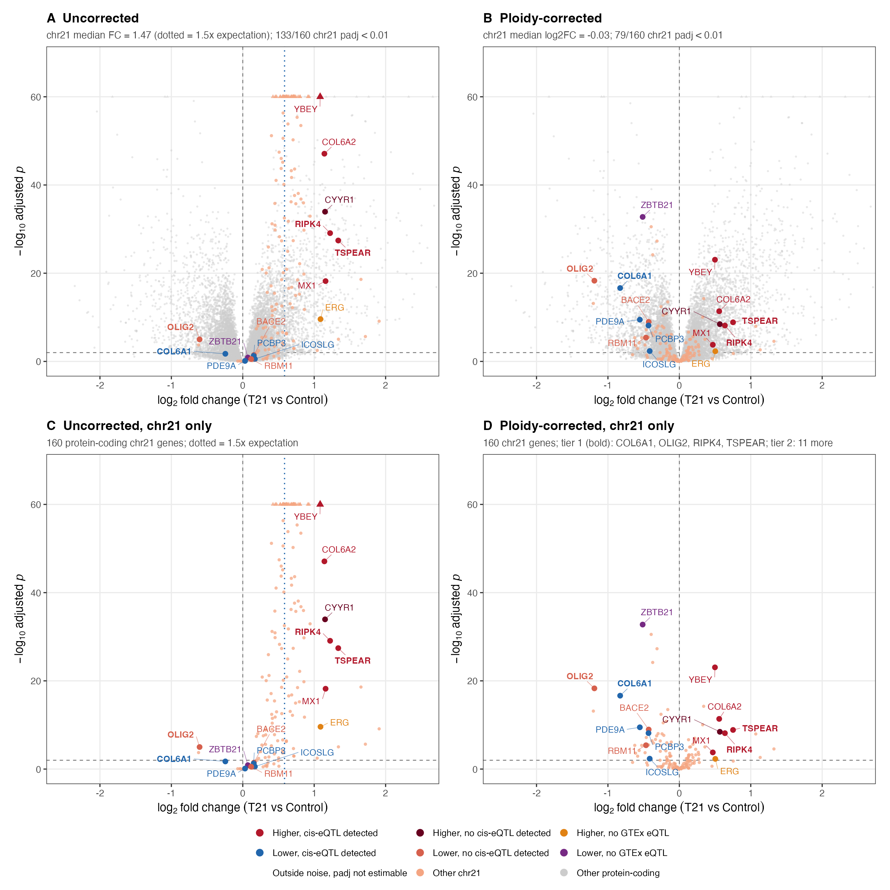
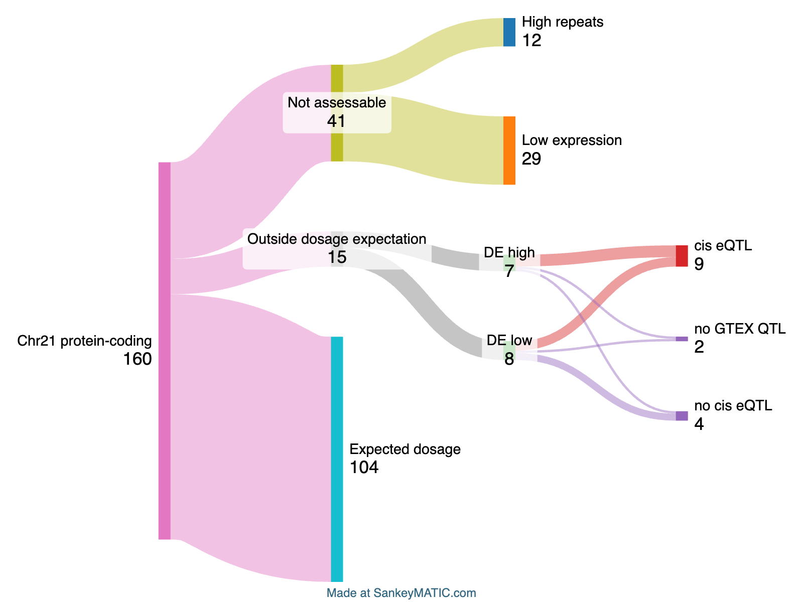

T21-eQTL results summary
================
2026-09-01

Computed from the pipeline outputs in `results/tables/` at commit
`18e85c6`. To refresh after a pipeline run:
`Rscript -e 'rmarkdown::render("docs/summary.Rmd")'`. Methodology and
its history: `README.md` and `docs/decisions.md`.

## Overview

Of the **160** chr21 protein-coding genes classified: **104** are
Expected dosage, **12** are flagged as high repeats and **29**
low-expression (baseMean below the chr21 20th percentile, 25.1 here),
and **15** deviate (**7** DE_high, **8** DE_low; **4** tier 1 (padj \<
0.01 and FC \>= 1.5), **11** tier 2, near-threshold (padj \< 0.01 and
4/3 \<= FC \< 1.5)). Of the deviating genes, **9** have a detectable
GTEx whole-blood cis-eQTL, **4** were tested and have none, and **2**
have no GTEx cis coverage.

| sig_lane        | cis_eqtl | no_GTEx_data | no_cis_eqtl | not_evaluated | Total |
|:----------------|---------:|-------------:|------------:|--------------:|------:|
| Expected_dosage |        0 |            0 |           0 |           104 |   104 |
| Low_expression  |        0 |            0 |           0 |            29 |    29 |
| High_repeats    |        0 |            0 |           0 |            12 |    12 |
| DE_low          |        4 |            1 |           3 |             0 |     8 |
| DE_high         |        5 |            1 |           1 |             0 |     7 |

Lane counts by eQTL terminal. cis_eqtl is a detection result (q_gene_bh
\< 0.05), not an ‘explained by eQTL’ claim.

## Deviating genes

| Gene | lane | tier | log2FC | padj | eqtl | q_perm | composition | residual_lfc |
|:---|:---|---:|---:|:---|:---|---:|:---|---:|
| TSPEAR | DE_high | 1 | 0.75 | 1.3e-09 | cis_eqtl | 0.0022 | GENE-SPECIFIC | 0.77 |
| RIPK4 | DE_high | 1 | 0.64 | 7.3e-09 | cis_eqtl | 0.0049 | GENE-SPECIFIC | 0.58 |
| CYYR1 | DE_high | 2 | 0.57 | 3.6e-09 | no_cis_eqtl | 0.1300 | GENE-SPECIFIC | 0.27 |
| COL6A2 | DE_high | 2 | 0.56 | 4.2e-12 | cis_eqtl | 0.0170 | GENE-SPECIFIC | 0.41 |
| YBEY | DE_high | 2 | 0.50 | 8.7e-24 | cis_eqtl | 0.0022 | GENE-SPECIFIC | 0.47 |
| ERG | DE_high | 2 | 0.50 | 4.9e-03 | no_GTEx_data | NA | PROGRAM | -0.55 |
| MX1 | DE_high | 2 | 0.47 | 1.7e-04 | cis_eqtl | 0.0049 | PROGRAM | 0.03 |
| OLIG2 | DE_low | 1 | -1.19 | 5.0e-19 | no_cis_eqtl | 0.1000 | MIXED | -0.79 |
| COL6A1 | DE_low | 1 | -0.83 | 2.3e-17 | cis_eqtl | 0.0022 | MIXED | -0.56 |
| PDE9A | DE_low | 2 | -0.55 | 3.4e-10 | cis_eqtl | 0.0022 | GENE-SPECIFIC | -0.42 |
| ZBTB21 | DE_low | 2 | -0.51 | 1.7e-33 | no_GTEx_data | NA | GENE-SPECIFIC | -0.27 |
| RBM11 | DE_low | 2 | -0.47 | 4.0e-06 | no_cis_eqtl | 0.0840 | PROGRAM | -0.20 |
| PCBP3 | DE_low | 2 | -0.43 | 7.0e-09 | cis_eqtl | 0.0022 | GENE-SPECIFIC | -0.39 |
| BACE2 | DE_low | 2 | -0.43 | 1.1e-09 | no_cis_eqtl | 0.1900 | PROGRAM | -0.04 |
| ICOSLG | DE_low | 2 | -0.42 | 4.4e-03 | cis_eqtl | 0.0022 | GENE-SPECIFIC | -0.28 |

Ploidy-corrected stats, gene-level permutation q, and
composition-control verdict. composition = verdict from the
partner-shift test (p = p_partners): PROGRAM if p \< 0.05 and
partner_lfc / gene_lfc \>= 0.5; MIXED if p \< 0.05 otherwise;
GENE-SPECIFIC for every other case (unconditional fallback).
residual_lfc = gene log2FC minus the median log2FC of its 20
control-defined co-expression partners.

Deviating genes without a detectable common cis-eQTL remain open as
compensation candidates (absence of a detection does not by itself
establish compensation):

- Tested against GTEx, no detection (4): **BACE2, CYYR1, OLIG2, RBM11**
- No GTEx cis coverage, untestable here (2): **ERG, ZBTB21**

## Figures

Copies of the pipeline figures, tracked under `docs/figures/`. To
refresh them, re-run scripts 06 and 07 (and re-export the lane flow from
SankeyMATIC using `results/tables/chr21_lane_sankeymatic_input.txt`),
copy the PNGs into `docs/figures/`, and re-render this document.

### chr21 vs baseMean-matched non-chr21 ploidy-corrected log2FC distributions, with the per-lane magnitude scatter (script 06):

### Volcano summary panel, all-genes before/after ploidy correction and chr21-only (script 07):

### Sankey plot generated with SankeyMATIC

