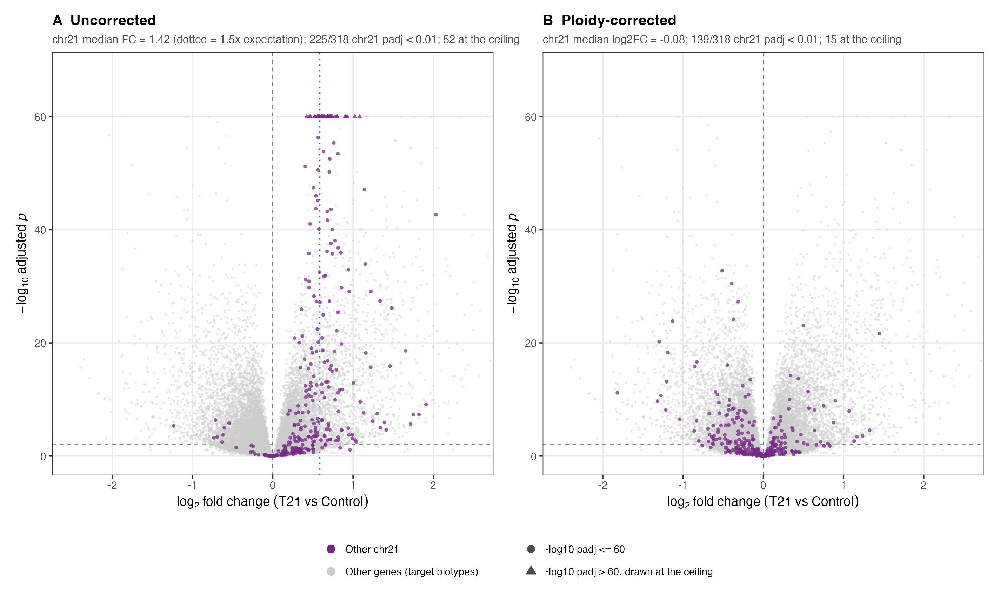
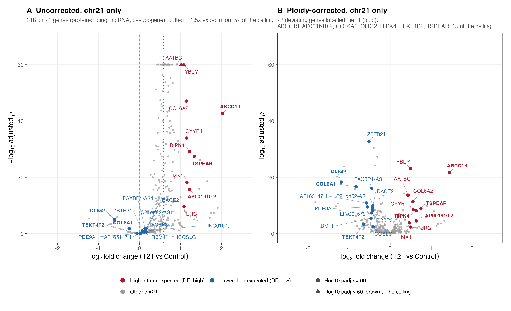
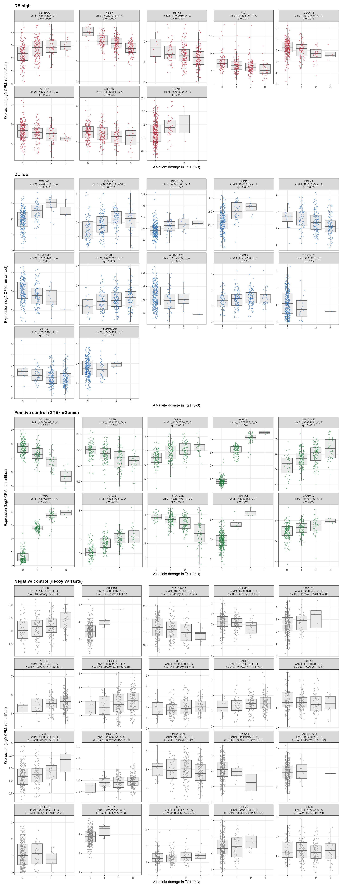
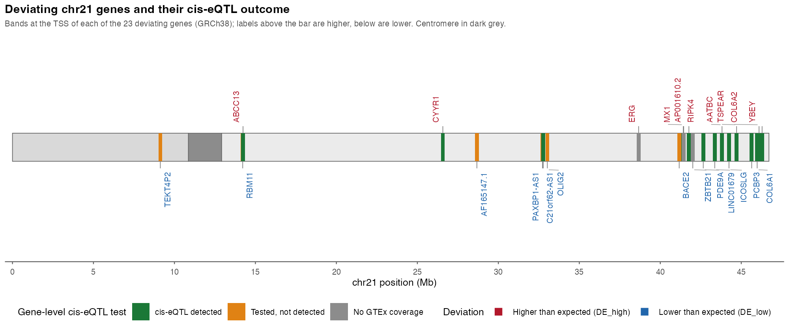
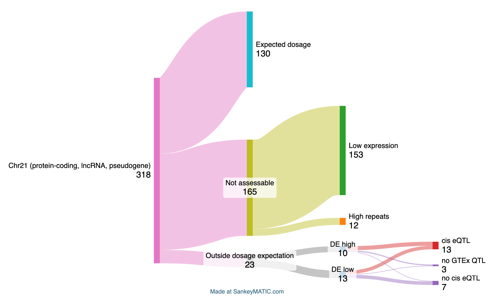
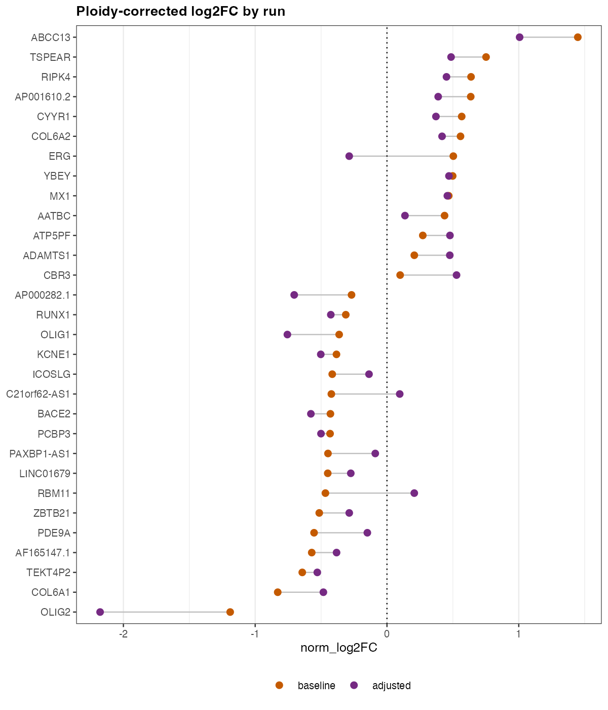
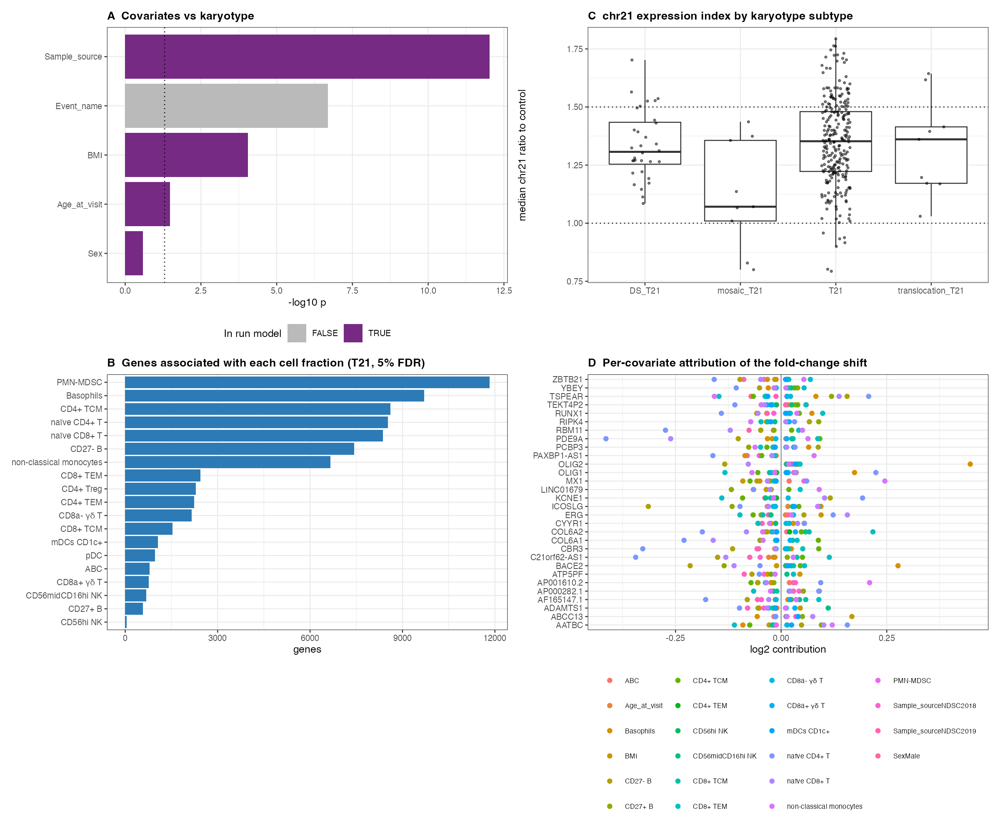

T21-eQTL results summary
================
2026-09-10

Computed from the pipeline outputs in `results/runs/<run>/tables/` at
commit `c2d79dc`. To refresh after a pipeline run:
`Rscript -e 'rmarkdown::render("docs/summary.Rmd")'`. Methodology and
its history: `README.md` and `docs/decisions.md`.

## Overview

Of the **318** chr21 genes classified (**160** protein-coding, **129**
lncRNA, **29** pseudogene: the biotypes GTEx whole blood tests for
cis-eQTLs): **130** are Expected dosage, **12** are flagged as high
repeats and **153** low-expression (baseMean below Hunter et al.’s
coverage floor of 30), and **23** deviate (**10** DE_high, **13**
DE_low; **7** tier 1 (padj \< 0.01 and \|corrected log2FC\| \>=
log2(1.5), a fold-change magnitude of 1.5 in either direction), **16**
tier 2, near-threshold (padj \< 0.01 and log2(4/3) \<= \|corrected
log2FC\| \< log2(1.5))). Of the deviating genes, **14** have a
detectable GTEx whole-blood cis-eQTL, **6** were tested and have none,
and **3** have no GTEx cis coverage.

| sig_lane        | cis_eqtl | no_GTEx_data | no_cis_eqtl | not_evaluated | Total |
|:----------------|---------:|-------------:|------------:|--------------:|------:|
| Low_expression  |        0 |            0 |           0 |           153 |   153 |
| Expected_dosage |        0 |            0 |           0 |           130 |   130 |
| DE_low          |        6 |            1 |           6 |             0 |    13 |
| High_repeats    |        0 |            0 |           0 |            12 |    12 |
| DE_high         |        8 |            2 |           0 |             0 |    10 |

Lane counts by eQTL terminal. cis_eqtl is a detection result (q_gene_bh
\< 0.05), not an ‘explained by eQTL’ claim.

## Deviating genes

| Gene         | lane    | tier | log2FC | padj    | eqtl         | q_perm |
|:-------------|:--------|-----:|-------:|:--------|:-------------|-------:|
| ABCC13       | DE_high |    1 |   1.45 | 2.2e-22 | cis_eqtl     | 0.0220 |
| TSPEAR       | DE_high |    1 |   0.75 | 1.3e-09 | cis_eqtl     | 0.0029 |
| RIPK4        | DE_high |    1 |   0.64 | 7.3e-09 | cis_eqtl     | 0.0067 |
| AP001610.2   | DE_high |    1 |   0.64 | 3.1e-05 | no_GTEx_data |     NA |
| CYYR1        | DE_high |    2 |   0.57 | 3.6e-09 | cis_eqtl     | 0.0410 |
| COL6A2       | DE_high |    2 |   0.56 | 4.2e-12 | cis_eqtl     | 0.0150 |
| YBEY         | DE_high |    2 |   0.50 | 8.7e-24 | cis_eqtl     | 0.0029 |
| ERG          | DE_high |    2 |   0.50 | 4.9e-03 | no_GTEx_data |     NA |
| MX1          | DE_high |    2 |   0.47 | 1.7e-04 | cis_eqtl     | 0.0140 |
| AATBC        | DE_high |    2 |   0.44 | 2.1e-14 | cis_eqtl     | 0.0220 |
| OLIG2        | DE_low  |    1 |  -1.19 | 5.0e-19 | no_cis_eqtl  | 0.1700 |
| COL6A1       | DE_low  |    1 |  -0.83 | 2.3e-17 | cis_eqtl     | 0.0029 |
| TEKT4P2      | DE_low  |    1 |  -0.64 | 4.2e-04 | no_cis_eqtl  | 0.1500 |
| AF165147.1   | DE_low  |    2 |  -0.57 | 1.4e-11 | no_cis_eqtl  | 0.1500 |
| PDE9A        | DE_low  |    2 |  -0.55 | 3.4e-10 | cis_eqtl     | 0.0029 |
| ZBTB21       | DE_low  |    2 |  -0.51 | 1.7e-33 | no_GTEx_data |     NA |
| RBM11        | DE_low  |    2 |  -0.47 | 4.0e-06 | no_cis_eqtl  | 0.0590 |
| LINC01679    | DE_low  |    2 |  -0.45 | 4.8e-08 | cis_eqtl     | 0.0029 |
| PAXBP1-AS1   | DE_low  |    2 |  -0.45 | 8.3e-17 | no_cis_eqtl  | 0.8100 |
| PCBP3        | DE_low  |    2 |  -0.43 | 7.0e-09 | cis_eqtl     | 0.0029 |
| BACE2        | DE_low  |    2 |  -0.43 | 1.1e-09 | no_cis_eqtl  | 0.1500 |
| C21orf62-AS1 | DE_low  |    2 |  -0.42 | 1.2e-10 | cis_eqtl     | 0.0050 |
| ICOSLG       | DE_low  |    2 |  -0.42 | 4.4e-03 | cis_eqtl     | 0.0029 |

Ploidy-corrected stats and the gene-level permutation q. eqtl is a
detection result; it does not identify what produces the deviation.

Deviating genes that carry no detected cis-eQTL. These deviations are
not accompanied by detectable cis-regulatory variation; the pipeline
does not attribute them to a mechanism:

- Tested against GTEx, no detection (6): **AF165147.1, BACE2, OLIG2,
  PAXBP1-AS1, RBM11, TEKT4P2**
- No GTEx cis coverage, untestable here (3): **AP001610.2, ERG, ZBTB21**

## Controls for the eQTL test

Two standalone gene sets go through the identical gene-level permutation
test (same runner, 1000 permutations, BH within the set, q \< 0.05). The
negative control pairs each deviating gene’s expression with the cis
variants of another tested gene at least 5 Mb away (no LD with its own
locus), choosing the one with the closest variant count; detections
should sit near the FDR level. The positive control takes the 10 chr21
genes with the strongest GTEx whole-blood cis-eQTL among expressed,
non-repeat, non-deviating genes and tests them on their own cis
variants; most should be detected, or the test lacks power at this
cohort size.

| run | set | n_tested | n_detected | pct_detected | expectation |
|:---|:---|---:|---:|---:|:---|
| baseline | observed_deviating | 20 | 14 | 70 | the result |
| baseline | negative_unlinked_variants | 20 | 0 | 0 | about 5% (the FDR level) |
| baseline | positive_gtex_egenes | 10 | 10 | 100 | most detected |
| adjusted | observed_deviating | 10 | 7 | 70 | the result |
| adjusted | negative_unlinked_variants | 10 | 0 | 0 | about 5% (the FDR level) |
| adjusted | positive_gtex_egenes | 10 | 10 | 100 | most detected |

eQTL test: observed set and the two standalone controls, both runs.

| Gene_name | gtex_min_p | n_variants | p_gene_perm | q_gene_bh | detected |
|:----------|:-----------|-----------:|------------:|----------:|:---------|
| PWP2      | 8.6e-175   |        304 |    0.000999 |    0.0011 | TRUE     |
| GATD3A    | 3.7e-169   |        244 |    0.000999 |    0.0011 | TRUE     |
| COL18A1   | 3.4e-127   |        255 |    0.000999 |    0.0011 | TRUE     |
| DIP2A     | 1.3e-114   |       1005 |    0.000999 |    0.0011 | TRUE     |
| LINC00649 | 1.7e-97    |        435 |    0.000999 |    0.0011 | TRUE     |
| CSTB      | 1.6e-85    |        368 |    0.000999 |    0.0011 | TRUE     |
| S100B     | 2.1e-84    |        937 |    0.000999 |    0.0011 | TRUE     |
| CFAP410   | 1.1e-72    |        207 |    0.004995 |    0.0050 | TRUE     |
| TRPM2     | 1.5e-69    |        419 |    0.000999 |    0.0011 | TRUE     |
| SPATC1L   | 3.2e-68    |        935 |    0.000999 |    0.0011 | TRUE     |

Baseline positive control: strongest GTEx whole-blood eGenes on chr21
outside the deviating set, tested within T21 on their own cis variants.

| Gene_name | decoy_gene | distance_mb | n_variants | p_gene_perm | q_gene_bh | detected |
|:---|:---|---:|---:|---:|---:|:---|
| PCBP3 | ABCC13 | 31.4 | 179 | 0.0079920 | 0.16 | FALSE |
| ABCC13 | PCBP3 | 31.4 | 161 | 0.0569431 | 0.39 | FALSE |
| TSPEAR | PAXBP1-AS1 | 12.0 | 10 | 0.0839161 | 0.39 | FALSE |
| AF165147.1 | LINC01679 | 14.7 | 63 | 0.0889111 | 0.39 | FALSE |
| COL6A2 | ABCC13 | 31.9 | 179 | 0.0979021 | 0.39 | FALSE |
| AATBC | AF165147.1 | 15.1 | 61 | 0.1408591 | 0.47 | FALSE |
| ICOSLG | C21orf62-AS1 | 11.5 | 114 | 0.1858142 | 0.48 | FALSE |
| OLIG2 | RIPK4 | 8.7 | 86 | 0.1928072 | 0.48 | FALSE |
| RIPK4 | RBM11 | 27.6 | 83 | 0.2577423 | 0.52 | FALSE |
| BACE2 | AF165147.1 | 12.5 | 61 | 0.2617383 | 0.52 | FALSE |
| CYYR1 | ABCC13 | 12.3 | 179 | 0.3176823 | 0.58 | FALSE |
| LINC01679 | AF165147.1 | 14.7 | 61 | 0.3906094 | 0.65 | FALSE |
| COL6A1 | C21orf62-AS1 | 13.2 | 114 | 0.6173826 | 0.88 | FALSE |
| C21orf62-AS1 | PDE9A | 9.9 | 107 | 0.6663337 | 0.88 | FALSE |
| TEKT4P2 | PAXBP1-AS1 | 23.6 | 10 | 0.6763237 | 0.88 | FALSE |
| PAXBP1-AS1 | TEKT4P2 | 23.6 | 1 | 0.7012987 | 0.88 | FALSE |
| YBEY | CYYR1 | 19.7 | 308 | 0.7932068 | 0.93 | FALSE |
| PDE9A | C21orf62-AS1 | 9.9 | 114 | 0.9550450 | 0.99 | FALSE |
| RBM11 | RIPK4 | 27.6 | 86 | 0.9770230 | 0.99 | FALSE |
| MX1 | ABCC13 | 27.2 | 179 | 0.9920080 | 0.99 | FALSE |

Baseline negative control: each deviating gene tested against the cis
variants of a distant tested gene (decoy). Genes without a decoy at
least 5 Mb away have no test.

## Figures

Copies of the pipeline figures, tracked under `docs/figures/`. To
refresh them, re-run scripts 06, 07, 11 and S1 for each run (and
re-export the lane flow from SankeyMATIC using
`results/runs/<run>/tables/chr21_lane_sankeymatic_input.txt`), copy the
PNGs into `docs/figures/`, and re-render this document.

### Effect of ploidy correction on the log2FC distribution: chr21 uncorrected vs corrected, with chr22 as the unchanged control (script 06):

### Volcano plots, all genes before and after ploidy correction (script 07):

### Volcano plots, chr21 only, deviating genes labelled (script 07):

### cis-eQTL effect size per gene, with its controls (script 11):

Each point is one gene’s best variant: its within-T21 slope on the
x-axis (the sign follows the alt allele, which is arbitrary) and the
gene-level permutation q on the y-axis, the value that decides
detection. The dashed line is q = 0.05. The median absolute slope is
0.22 log2-CPM per allele on the deviating genes’ own variants, 0.09 on
their decoy sets, and 0.47 for the positive controls. With 1000
permutations q cannot fall much below 0.001, so the strongest genes
share the top row and differ only in slope. Genes with no GTEx variants
have neither value and are named in the subtitle. Every slope is the
best of many variants, so it is inflated by that selection; the decoys
show that a large best-variant slope can occur with no cis link, as for
the rare variant behind the far-right decoy.

### Expression by genotype for every tested gene and control (script 11):

### Deviating genes along chr21 (script 11):

### Sankey plot generated with SankeyMATIC

## Covariate-adjusted run

The baseline result above follows Hunter et al.: no covariates. Age,
BMI, sample source and visit differ between T21 and control subjects in
this cohort (S1 panel A), blood cell composition differs by karyotype
and tracks thousands of genes (S1 panel B), and 9 T21 subjects are
mosaic, with a chr21 expression index near 1.07 rather than 1.35 (S1
panel C). The `adjusted` run (`config/runs/adjusted.R`) therefore fits
`~ age + sex + BMI + sample source + 19 CyTOF cell fractions + karyotype`
on the 354 samples (274 T21, 80 Control) that have every covariate, with
mosaic T21 excluded, and its eQTL stage reads the covariate-adjusted
expression artifact. It is reported beside the baseline, not instead of
it: BMI and composition are plausibly downstream of trisomy, so this run
estimates the deviation net of those pathways.

| reason                               |   n |
|:-------------------------------------|----:|
| exclude:karyotype_subtype=mosaic_T21 |   9 |
| keep_rule:no_wgs                     |   2 |
| missing:BMI                          |  12 |
| missing:cytof                        |  22 |

Samples excluded from the adjusted run, by reason.

| sig_lane             | eqtl_lane     | n_genes |
|:---------------------|:--------------|--------:|
| DE_high              | cis_eqtl      |       4 |
| DE_high              | no_GTEx_data  |       1 |
| DE_high              | no_cis_eqtl   |       1 |
| DE_low               | cis_eqtl      |       3 |
| DE_low               | no_GTEx_data  |       2 |
| DE_low               | no_cis_eqtl   |       2 |
| Expected_dosage      | not_evaluated |     129 |
| High_repeats         | not_evaluated |      12 |
| Low_expression       | not_evaluated |     153 |
| Not_DE_outside_noise | not_evaluated |      11 |

Adjusted run: chr21 genes by classification lane and eQTL terminal.
Not_DE_outside_noise = clears the magnitude cut but not padj \< 0.01 in
the adjusted model.

Of the 23 genes deviating in the baseline, 6 still deviate after
adjustment (OLIG2, PCBP3, BACE2, YBEY, COL6A2, ABCC13), 17 do not
(COL6A1, TEKT4P2, AF165147.1, PDE9A, ZBTB21, RBM11, LINC01679,
PAXBP1-AS1, C21orf62-AS1, ICOSLG, AATBC, MX1, ERG, CYYR1, AP001610.2,
RIPK4, TSPEAR), and 7 genes deviate only in the adjusted run (KCNE1,
OLIG1, RUNX1, AP000282.1, CBR3, ADAMTS1, ATP5PF). 11 genes clear the
magnitude cut in the adjusted model without reaching padj \< 0.01; the
adjusted model has 24 more parameters and 43 fewer samples, so its
adjusted p-values are less powerful as well as adjusted.

| lane_baseline   | lane_adjusted        |   N |
|:----------------|:---------------------|----:|
| DE_high         | DE_high              |   3 |
| DE_high         | Expected_dosage      |   4 |
| DE_high         | Not_DE_outside_noise |   3 |
| DE_low          | DE_low               |   3 |
| DE_low          | Expected_dosage      |   8 |
| DE_low          | Not_DE_outside_noise |   2 |
| Expected_dosage | DE_high              |   3 |
| Expected_dosage | DE_low               |   4 |
| Expected_dosage | Expected_dosage      | 117 |
| Expected_dosage | Not_DE_outside_noise |   6 |
| High_repeats    | High_repeats         |  12 |
| Low_expression  | Low_expression       | 153 |

Lane transitions, baseline to adjusted, all chr21 genes.

| Gene | lane (baseline) | lane (adjusted) | log2FC (baseline) | log2FC (adjusted) | eQTL (baseline) | eQTL (adjusted) |
|:---|:---|:---|---:|---:|:---|:---|
| OLIG2 | DE_low | DE_low | -1.19 | -2.18 | no_cis_eqtl | no_cis_eqtl |
| COL6A1 | DE_low | Not_DE_outside_noise | -0.83 | -0.48 | cis_eqtl | not_evaluated |
| TEKT4P2 | DE_low | Not_DE_outside_noise | -0.64 | -0.53 | no_cis_eqtl | not_evaluated |
| AF165147.1 | DE_low | Expected_dosage | -0.57 | -0.38 | no_cis_eqtl | not_evaluated |
| PDE9A | DE_low | Expected_dosage | -0.55 | -0.15 | cis_eqtl | not_evaluated |
| ZBTB21 | DE_low | Expected_dosage | -0.51 | -0.29 | no_GTEx_data | not_evaluated |
| RBM11 | DE_low | Expected_dosage | -0.47 | 0.21 | no_cis_eqtl | not_evaluated |
| LINC01679 | DE_low | Expected_dosage | -0.45 | -0.27 | cis_eqtl | not_evaluated |
| PAXBP1-AS1 | DE_low | Expected_dosage | -0.45 | -0.09 | no_cis_eqtl | not_evaluated |
| PCBP3 | DE_low | DE_low | -0.43 | -0.50 | cis_eqtl | cis_eqtl |
| BACE2 | DE_low | DE_low | -0.43 | -0.58 | no_cis_eqtl | no_cis_eqtl |
| C21orf62-AS1 | DE_low | Expected_dosage | -0.42 | 0.10 | cis_eqtl | not_evaluated |
| ICOSLG | DE_low | Expected_dosage | -0.42 | -0.14 | cis_eqtl | not_evaluated |
| KCNE1 | Expected_dosage | DE_low | -0.38 | -0.50 | not_evaluated | cis_eqtl |
| OLIG1 | Expected_dosage | DE_low | -0.36 | -0.76 | not_evaluated | cis_eqtl |
| RUNX1 | Expected_dosage | DE_low | -0.31 | -0.43 | not_evaluated | no_GTEx_data |
| AP000282.1 | Expected_dosage | DE_low | -0.27 | -0.70 | not_evaluated | no_GTEx_data |
| CBR3 | Expected_dosage | DE_high | 0.10 | 0.53 | not_evaluated | cis_eqtl |
| ADAMTS1 | Expected_dosage | DE_high | 0.21 | 0.48 | not_evaluated | cis_eqtl |
| ATP5PF | Expected_dosage | DE_high | 0.27 | 0.48 | not_evaluated | no_GTEx_data |
| AATBC | DE_high | Expected_dosage | 0.44 | 0.14 | cis_eqtl | not_evaluated |
| MX1 | DE_high | Not_DE_outside_noise | 0.47 | 0.46 | cis_eqtl | not_evaluated |
| YBEY | DE_high | DE_high | 0.50 | 0.47 | cis_eqtl | cis_eqtl |
| ERG | DE_high | Expected_dosage | 0.50 | -0.29 | no_GTEx_data | not_evaluated |
| COL6A2 | DE_high | DE_high | 0.56 | 0.42 | cis_eqtl | cis_eqtl |
| CYYR1 | DE_high | Expected_dosage | 0.57 | 0.37 | cis_eqtl | not_evaluated |
| AP001610.2 | DE_high | Expected_dosage | 0.64 | 0.39 | no_GTEx_data | not_evaluated |
| RIPK4 | DE_high | Not_DE_outside_noise | 0.64 | 0.45 | cis_eqtl | not_evaluated |
| TSPEAR | DE_high | Not_DE_outside_noise | 0.75 | 0.49 | cis_eqtl | not_evaluated |
| ABCC13 | DE_high | DE_high | 1.45 | 1.01 | cis_eqtl | no_cis_eqtl |

Genes deviating in either run. Ploidy-corrected DESeq2 log2FC; eQTL
columns are empty where a gene was not deviating in that run.

| Gene | largest term | log2 contribution | log2FC (baseline) | log2FC (adjusted) |
|:---|:---|---:|---:|---:|
| OLIG2 | Basophils | 0.448 | -1.19 | -2.18 |
| PDE9A | naïve CD4+ T | -0.415 | -0.55 | -0.15 |
| C21orf62-AS1 | naïve CD4+ T | -0.344 | -0.42 | 0.10 |
| CBR3 | naïve CD4+ T | -0.328 | 0.10 | 0.53 |
| ICOSLG | CD27- B | -0.314 | -0.42 | -0.14 |
| BACE2 | Basophils | 0.277 | -0.43 | -0.58 |
| RBM11 | naïve CD4+ T | -0.274 | -0.47 | 0.21 |
| MX1 | non-classical monocytes | 0.246 | 0.47 | 0.46 |
| COL6A1 | naïve CD4+ T | -0.230 | -0.83 | -0.48 |
| OLIG1 | naïve CD4+ T | 0.224 | -0.36 | -0.76 |
| COL6A2 | CD8+ TEM | 0.217 | 0.56 | 0.42 |
| AP001610.2 | non-classical monocytes | 0.209 | 0.64 | 0.39 |
| TSPEAR | naïve CD4+ T | 0.207 | 0.75 | 0.49 |
| KCNE1 | naïve CD4+ T | 0.193 | -0.38 | -0.50 |
| AF165147.1 | naïve CD4+ T | -0.179 | -0.57 | -0.38 |

Per-covariate attribution of the fold-change shift (S1 panel D, artifact
scale): for each deviating gene, the covariate whose product of
(coefficient) x (T21 minus control mean) is largest. Descriptive;
correlated fractions make single terms less stable than the total.

